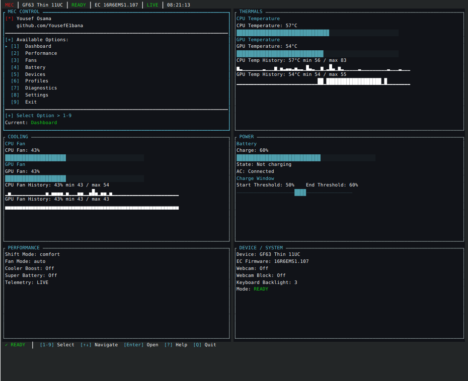

<p align="center"></p>

# MEC — MSI EC Control Center

Safe hardware monitoring and control for supported MSI laptops on Linux.

[](https://github.com/YousefE1bana/msi-ec-tui/actions/workflows/ci.yml)
[](https://github.com/YousefE1bana/msi-ec-tui/releases/latest)
[](LICENSE)



**Stable release: v1.1.0.** Screenshots show the production v1.1 interface on
a physical laptop with real telemetry. See [release notes](docs/releases/v1.1.0.md)
for changes, validation and known limitations.

MEC brings temperatures, fan percentages, power state, performance controls,
battery charge limits, and supported devices into one terminal workspace.
Keyboard and mouse changes are staged, reviewed, and explicitly confirmed.
Writes use capability checks and verified readback. Profiles add transaction
preflight and rollback. Unsupported hardware remains READ-ONLY.

## Install

Download and inspect the installer before running it:

```sh
curl -fsSLO https://raw.githubusercontent.com/YousefE1bana/msi-ec-tui/main/install.sh
less install.sh
bash install.sh --dry-run
bash install.sh
mec doctor
mec
```

The installer selects the **latest stable release**, verifies its exact SHA256SUMS entry,
and prefers `.deb` / `.rpm`; otherwise it uses a user-local portable binary.
`--version 1.1.0` pins a stable release. Checksums check integrity; they are not
cryptographic publisher signatures. The installer does not install kernel code.

Requirements: Linux, compatible physical MSI hardware, a working
[msi-ec driver](https://github.com/BeardOverflow/msi-ec), and a true-color terminal
for the intended appearance. Release binaries target x86_64/aarch64 glibc Linux
(glibc 2.39 or newer). aarch64 hardware support is unverified. See
[installation](docs/installation.md), [compatibility](docs/compatibility.md), and
[driver setup](docs/hardware-support.md) before installing on another distro.

READY is a support verdict, not a privilege grant. Desktop launchers run as your
normal user; root-owned sysfs controls can reject writes. MEC never elevates
itself. See [permissions and troubleshooting](docs/troubleshooting.md).

## Controls

| Input | Action |
|---|---|
| `1`–`8` | Dashboard, Performance, Fans, Battery, Devices, Profiles, Diagnostics, Settings |
| `9` / `q` | Exit |
| Arrows / `h j k l` | Navigate rows or adjust an open editor (vim keys configurable) |
| Tab / Shift-Tab | Next / previous screen |
| Enter | Edit → Review → explicit Apply |
| Esc | Cancel pending edit/review; close overlays |
| `P` / `?` | Command palette / Help |
| Click row / value | Select / enter the existing editor |
| Wheel | Navigate rows and lists |
| Review / Apply | Inspect staged changes / explicitly confirm on review |

Clicking a telemetry card only focuses it. Selecting a profile applies nothing.
The review displays current/requested values and says nothing has been applied
until confirmation. Fan telemetry is **percentage/raw data, not RPM**.
Settings exposes actual preferences; About offers an explicit update check.
`mec update-check` queries GitHub without installing anything or sending telemetry.

## Profiles and CLI

```sh
mec status
mec status --json
mec doctor --export
mec profile list
mec profile show silent
```

Built-ins: Balanced, Silent, Gaming, Battery Saver, Maximum Cooling. They resolve
only advertised performance capabilities. Custom TOML profiles are strict data,
never shell scripts. Read [profiles](docs/profiles.md) before applying one.
CLI mutation commands execute explicitly; the TUI adds stage/review confirmation.

## Themes

MSI Dark remains the default. Optional themes retain the same layouts and
semantic green/amber/red status colors:

```sh
mec                     # configured theme; MSI Dark on a fresh configuration
mec --theme arctic      # Arctic Midnight, this session only
mec --theme graphite    # Graphite Violet, this session only
```

Palette theme choices persist in the existing configuration.
[Configuration](docs/configuration.md) · [theme comparison](docs/themes.md)

## Documentation

[Install](docs/installation.md) · [Upgrade](docs/upgrade.md) ·
[Uninstall](docs/uninstall.md) · [Hardware support](docs/hardware-support.md) ·
[Compatibility](docs/compatibility.md) · [Troubleshooting](docs/troubleshooting.md) ·
[Architecture](docs/architecture.md) · [Screenshots](docs/screenshots.md) · [Physical validation](docs/physical-validation.md) ·
[Pre-release validation record](docs/release-candidate-validation.md)

For bugs, review `mec doctor --export` for private information before sharing it.
Use [GitHub issues](https://github.com/YousefE1bana/msi-ec-tui/issues) for public bugs;
report vulnerabilities through [SECURITY.md](SECURITY.md).
[Contributing](CONTRIBUTING.md) · [MIT license](LICENSE)

Created by **Yousef Osama** — [YousefE1bana](https://github.com/YousefE1bana).
MEC is an independent project. It uses the upstream
[BeardOverflow/msi-ec](https://github.com/BeardOverflow/msi-ec) Linux driver;
its original geometric logo does not use MSI vendor artwork.
