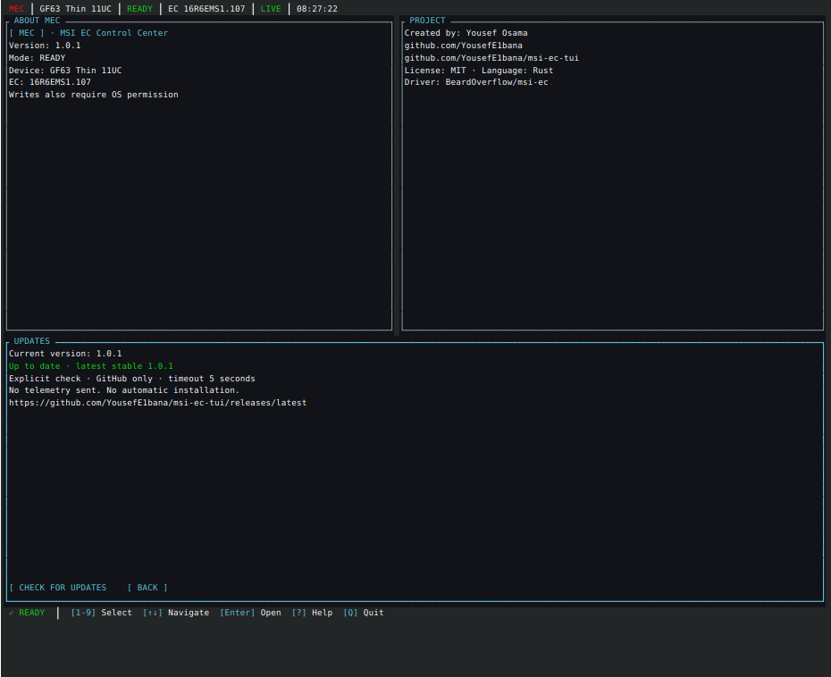

# Production screenshot gallery

Captured on the physical GF63 Thin 11UC with KDE Spectacle, Konsole and the
production release binary. All telemetry is real. These 47 captures document
the v1.1 interface during physical QA before the package-version bump; any
visible 1.0.1 version label records that capture, not the current release. The
current package and About version are 1.1.0. The gallery includes the three smaller viewport sets and a real [access-denied result](assets/screenshots/permission-error-80x24.png).

| View | Actual capture |
|---|---|
| Performance | [Performance](assets/screenshots/performance.png) |
| Fans | [Fans](assets/screenshots/fans.png) |
| Battery | [Battery](assets/screenshots/battery.png) |
| Devices | [Devices](assets/screenshots/devices.png) |
| Selected profile | [Silent selected](assets/screenshots/profiles-selected.png) |
| Review, before Apply | [Review Changes](assets/screenshots/review.png) |
| Diagnostics | [Diagnostics](assets/screenshots/diagnostics.png) |
| Settings | [Settings](assets/screenshots/settings.png) |
| Help / palette | [Help](assets/screenshots/help.png), [palette](assets/screenshots/palette.png) |
| About | [MEC information](assets/screenshots/mec-about.png) |
| Optional themes | [Arctic Midnight](assets/screenshots/dashboard-arctic.png), [Graphite Violet](assets/screenshots/dashboard-graphite.png) |

For each of `120x35`, `100x30`, and `80x24`, the assets directory also contains
`dashboard`, `performance`, `fans`, `battery`, `devices`, `profiles`,
`diagnostics`, `settings`, `about`, and `review` images with that size suffix.
For example, [80×24 review](assets/screenshots/review-80x24.png) retains the
pending values, nothing-applied warning, Cancel and Apply. More metadata is
clipped at smaller sizes; hidden regions cannot remain actionable.

