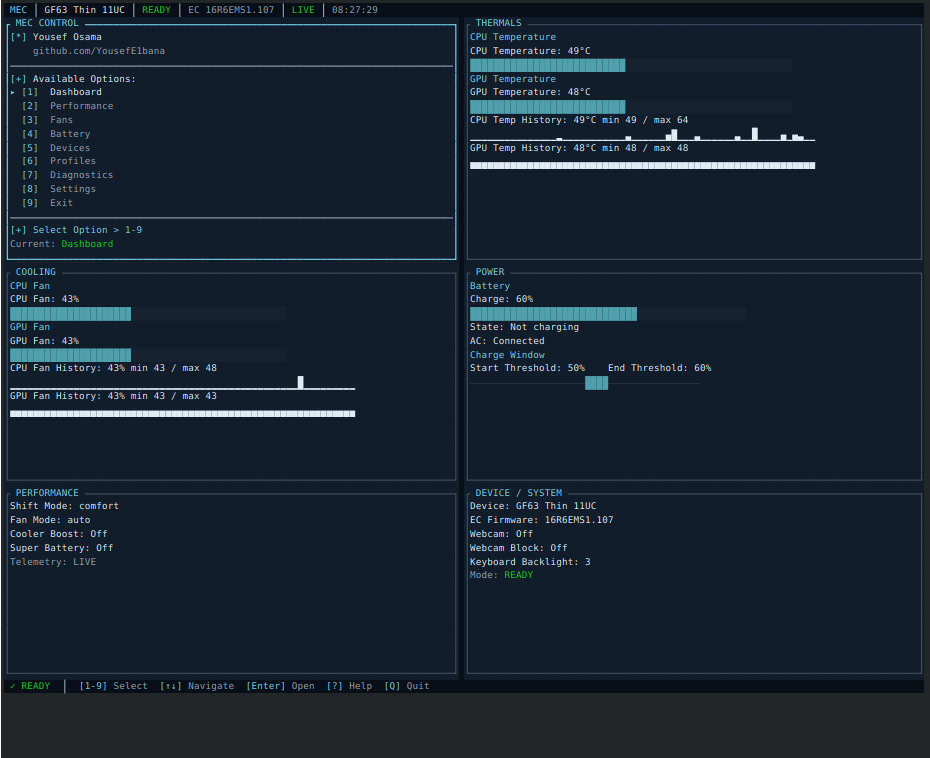
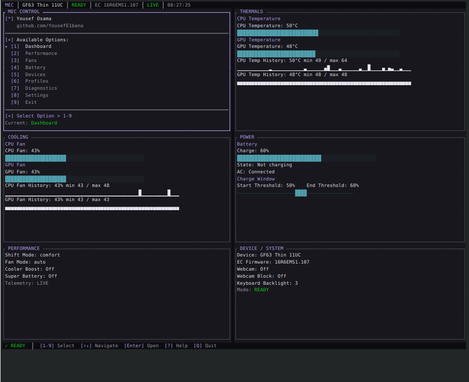

# Themes

The default MSI Dark is unchanged. Terminal and Light remain supported.
Arctic Midnight uses navy surfaces and ice-cyan focus. Graphite Violet uses
charcoal/graphite surfaces and a restrained violet focus. All screens consume
semantic roles, not theme-specific layouts. Green remains verified success /
READY, amber remains staged/pending/warning, red remains failure. Telemetry
meters retain #4F9FAD on #223238. Neither optional theme uses reverse video.

```sh
mec --theme arctic
mec --theme graphite
```

These flags affect only this session. Use P → Theme to save a choice to the
existing config schema. Both themes are optional; no default promotion has
been made. Actual production screenshots:



